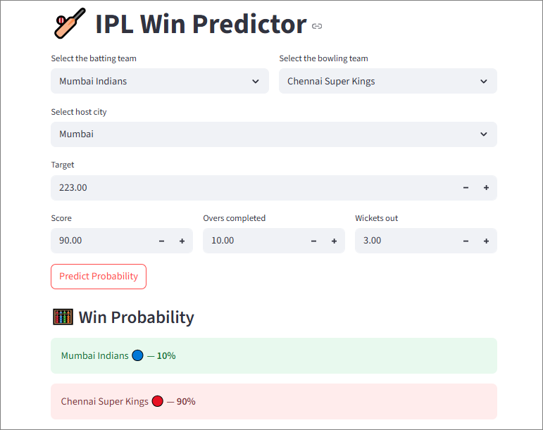

# 🏏 IPL Win Predictor

A simple and interactive web app built with Streamlit that predicts the win probability of an IPL team based on the current match situation. Just input live match details like score, overs, wickets, and teams — and get instant win predictions!

📊 Note: The model is trained on historical IPL data from 2008 to 2019, ensuring reliable predictions based on real match trends and outcomes.

---

## 🖼️ Preview



---

## ⚙️ How It Works

The app uses a machine learning model trained on IPL match data to calculate real-time win probabilities. Based on:

- Batting and bowling teams
- Host city
- Target score
- Current score, overs completed, and wickets lost

It calculates:
- Runs left
- Balls remaining
- Current Run Rate (CRR)
- Required Run Rate (RRR)

These features are fed into a trained ML pipeline (`pipe.pkl`) to predict the chances of each team winning.

---

## 🚀 Run the App Locally

1. **Clone this repository**
   ```bash
   git clone https://github.com/omkarpatil2004/IPL-Win-Predictor.git
   cd IPL-Win-Predictor

2. **Install dependencies**

   ```bash
   pip install -r requirements.txt
   ```

3. **Run the app**

   ```bash
   streamlit run app.py
   ```

---

## 📁 Project Structure

```
📁 IPL-Win-Predictor/
├── app.py                        # Main Streamlit app
├── pipe.pkl                      # Trained ML model
├── requirements.txt              # Python libraries
├── Screenshot.PNG                # UI screenshot for README
├── IPL_Win_Predictor.ipynb       # Model training & EDA notebook
├── matches.csv                   # Match dataset
├── deliveries.csv                # Delivery dataset
├── description.pdf               # Project report (optional)
└── README.md                     # This file
```

---

## 🧠 Technologies Used

* Python 🐍
* Streamlit ⚡
* Pandas & NumPy 📊
* Scikit-learn 🤖
* Pickle 📦

---

## 🌐 Live Demo (optional)

> Will be added after deployment on [Streamlit Cloud](https://ipl-win-predictor-omkarpatil2004.streamlit.app)

---

## 👤 Author

**Omkar Abhaykumar Patil**
📧 [patilomkar0307@gmail.com.com](mailto:patilomkar0307@gmail.com)
🔗 [GitHub](https://github.com/omkarpatil2004)
🔗 [LinkedIn](https://www.linkedin.com/in/omkar-patil-6a2275263?utm_source=share&utm_campaign=share_via&utm_content=profile&utm_medium=android_app))

---
